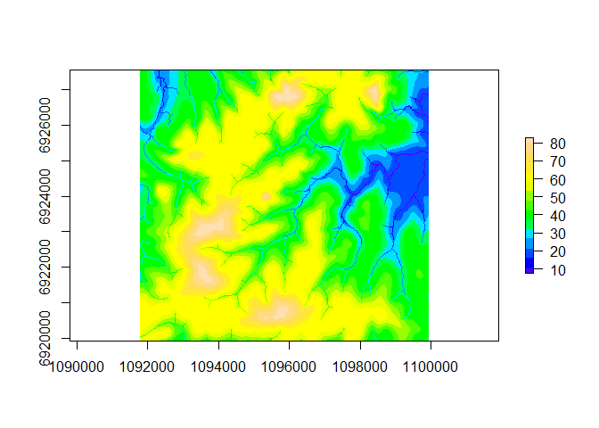
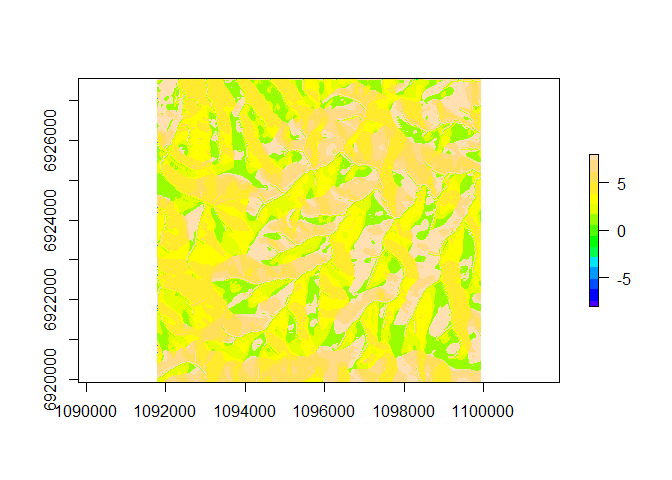
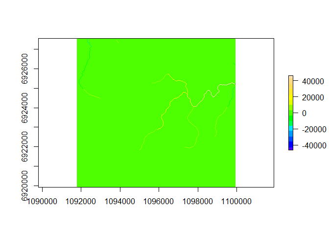

rdwplus
=======

The package `rdwplus` is an open source implementation of IDW-PLUS (inverse distance weighted percent land use for streams) from Peterson & Pearse (2017). IDW-PLUS itself is a toolset that calculates the spatially explicit landscape representation metrics previously developed and used in Peterson et al. (2011). It is a Python-based ArcGIS toolbox, originally developed for ArcGIS version 10.3.1. This fully open-source implementation uses R as the scripting language, with calls to modules and tools from GRASS GIS (GRASS Development Team, 2019) to do the heavy lifting.

Installation
------------

At present, `rdwplus` is available on GitHub only. Install the package `rdwplus` by using the command `devtools::install_github("apear9/rdwplus")`. Note that the package `devtools` must be installed in order for this command to run.

Note that `rdwplus` calls GRASS GIS, so the user may also have to install GRASS GIS. The software is available at <https://grass.osgeo.org/download/> or, for Windows users, as part of the OSGeo4W bundle at <https://trac.osgeo.org/osgeo4w/>.

Using rdwplus
-------------

Load `rdwplus` after it has been installed.

``` r
library(rdwplus)
```

A preliminary note
------------------

This markdown document has been generated in such a way that warnings and messages from GRASS were suppressed. Therefore, you may see the console print some angry-looking messages when you run this code. Do not worry.

Retrieving the example data
---------------------------

`rdwplus` comes with a very small example dataset for illustrative purposes. We load and manipulate it using `rdwplus` functions below. But first, the following code needs to be run in order to access the example dataset files.

``` r
dem <- system.file("extdata", "dem.tif", package = "rdwplus")
lus <- system.file("extdata", "landuse.tif", package = "rdwplus")
sts <- system.file("extdata", "site.shp", package = "rdwplus")
stm <- system.file("extdata", "streams.shp", package = "rdwplus")
```

Setting up a GRASS session
--------------------------

A GRASS session can very easily be set up through R. First, the user must find a folder containing their installation of GRASS GIS. If the user does not know where this folder is located, they can search for it by running

``` r
# Path to GRASS
my_grass <- "C:/Program Files/GRASS GIS 7.6"
# If you don't know where the GRASS installation sits on your
# computer, use the following.
# Note this may yield more than one directory, hence the [1]
# my_grass <- search_for_grass()[1]
```

Once the location of the user's GRASS installation is known, the function `initGRASS` can be called to set up the GRASS session.

``` r
initGRASS(my_grass, mapset = "PERMANENT", override = TRUE)
```

    ## gisdbase    C:/Users/apear/AppData/Local/Temp/RtmpCcS1Ok 
    ## location    file1ce06e59f17 
    ## mapset      PERMANENT 
    ## rows        1 
    ## columns     1 
    ## north       1 
    ## south       0 
    ## west        0 
    ## east        1 
    ## nsres       1 
    ## ewres       1 
    ## projection  NA

At this stage it is possible to set other environment parameters but, for this demonstration, the above is fine.

Now we can check that a GRASS session is running.

``` r
check_running()
```

    ## [1] TRUE

We can then set up the GRASS environment. This means setting the extent, spatial resolution, coordinate system, etc., of the current GRASS mapset. This is done by giving the function `set_envir()` a file path to a raster file.

``` r
# Give this function a filepath for a raster
set_envir(dem)
```

Importing data into the mapset
------------------------------

Now that we have set up and configured our GRASS session, we need to import raster and vector data into the GRASS mapset, which is a collection of layers that GRASS operations can refer to. For rasters, for example, our digital elevation model and landuse raster, this is done with

``` r
raster_to_mapset(c(dem, lus), as_integer = c(FALSE, TRUE), overwrite = TRUE)
```

    ## [1] "dem.tif"     "landuse.tif"

For vector data, for example our shapefiles of sites and stream channels, we need to use

``` r
vector_to_mapset(c(sts, stm), overwrite = TRUE)
```

    ## [1] "site.shp"    "streams.shp"

Note that the `overwrite` option simply allows the dataset we're importing to overprint any existing layers with the same name in the current GRASS mapset. Note also that the name of the file in the GRASS mapset is not the same as the full file path. Instead, it is `basename(filepath)`.

Data preprocessing
------------------

### The streams

If you start with a shapefile of stream edges (as opposed to deriving a streams raster from the DEM), then you will need to

1.  Rasterise the stream;
2.  Reclassify it so that the stream line cells have a value of 1 and the others a value of 0. (This is needed to perform 'drainage reinforcement' on the streams, which forces water to flow along the stream lines.)

The rasterisation and reclassification step can be performed in two separate lines of code:

``` r
rasterise_stream("streams", "streams.tif", TRUE)
reclassify_streams("streams.tif", "streams01.tif", overwrite = TRUE)
```

### The digital elevation model

As alluded to above, if your streams were not derived from the digital elevation model (DEM) itself, the streams need to be 'burned in' to the DEM. This can be done using the `burn_in` function:

``` r
# Drainage reinforcement
burn_in(dem, "streams01.tif", "burndem.tif", overwrite = TRUE)
```

The DEM must then be hydrologically corrected. This is a process of removing 'sinks'; small depressions in the DEM where flowing water gets trapped and stops flowing toward the streams. Of course, sinks are actually natural features of the landscape. However, our metrics cannot deal with them. Therefore, we remove them using the `fill_sinks` function:

``` r
# Fill dem
fill_sinks("burndem.tif", "filldem.tif", flags = "a", overwrite = TRUE)
```

Once the DEM has been hydrologically conditioned, we can use it to derive valid flow direction and flow accumulation rasters. These are inputs for the `compute_metrics` function so it is essential that the `derive_flow` function is run to get these rasters.

``` r
# Derive flow direction and accumulation rasters
derive_flow("filldem.tif", "flowdir.tif", "flowacc.tif", overwrite = TRUE)
```

If you're curious to see what these look like:

``` r
plot_GRASS("filldem.tif", col = topo.colors(15))
```



``` r
plot_GRASS("flowdir.tif", col = topo.colors(15))
```



``` r
plot_GRASS("flowacc.tif", col = topo.colors(15))
```



### The sites

The land use metrics we calculate with `rdwplus` relate to percentages of effective landuse within watersheds. The sites are treated as the outlets (the point of lowest elevation) for the stream watersheds, and enable the delineation of these regions. In order to obtain the correct watershed, we need to ensure the sites are snapped to the stream line; a region of high flow accumulation. If the sites are not snapped to the flow accumulation grid, then degenerate watersheds can result. These degenerate watersheds tend to have only a few raster cells in them.

Here is the code for snapping sites to the flow accumulation grid:

``` r
# Snap sites to flow accumulation grid
snap_sites("site", "flowacc.tif", 2, "snapsite", TRUE)
```

Note that in this case, no snapping is needed as the point in the shapefile already falls along a raster cell with high flow accumulation.

Compute watershed attributes
----------------------------

Once the preprocessing steps have been completed, we can use the `compute_metrics` function to derive the spatially explicit land use metrics for our survey sites.

``` r
# Compute metrics
compute_metrics(
  c("lumped", "iFLO", "iEDO", "HAiFLO", "iFLS", "iEDS", "HAiFLS"),
  "landuse.tif", # needs to be integer 
  sts, 
  "dem.tif",
  "flowdir.tif",
  "flowacc.tif", 
  "streams.tif", # needs to be integer
  -1
)
```

    ##   ID lumped_landuse iFLO_landuse iEDO_landuse HAiFLO_landuse iFLS_landuse
    ## 1  1       2.059486     1.179034     1.097731    0.005071802     1.556769
    ##   iEDS_landuse HAiFLS_landuse
    ## 1     1.847157         1.2414

Contributors
------------

-   [Alan Pearse](https://github.com/apear9)
-   [Grace Heron](https://github.com/GraceHeron)

References
----------

GRASS Development Team. (2019). Geographic Resources Analysis Support System (GRASS) Software, Version 7.6. Open Source Geospatial Foundation. <https://grass.osgeo.org>

Peterson, E.E. and Pearse, A.R. (2017). IDW-PLUS: an ArcGIS toolset for calculating spatially explicit watershed attributes for survey sites. *Journal of the American Water Resources Association*, *53*(5), 1241-1249. doi: 10.1111/1752-1688.12558

Peterson, E.E., Sheldon, F., Darnell, R., Bunn, S.E. and Harch, B.D. (2011). A comparison of spatially explicit landscape representation methods and their relationship to stream condition. *Freshwater Biology*, *56*(3), 590-610. doi: 10.1111/j.1365-2427.2010.02507.x.
