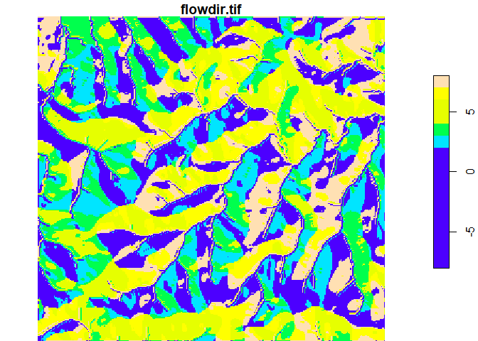
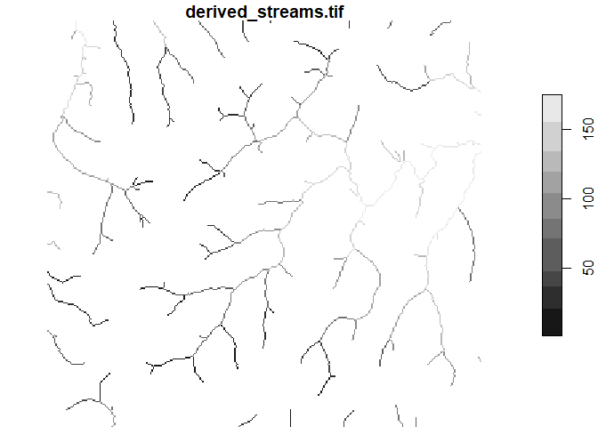

# rdwplus

The package `rdwplus` is an open source implementation of IDW-PLUS
(inverse distance weighted percent land use for streams) from Peterson &
Pearse (2017). IDW-PLUS itself is a toolset that calculates the
spatially explicit landscape representation metrics previously developed
and used in Peterson et al. (2011). It is a Python-based ArcGIS toolbox,
originally developed for ArcGIS version 10.3.1. This fully open-source
implementation uses R as the scripting language, with calls to modules
and tools from GRASS GIS (GRASS Development Team, 2019) to do the heavy
lifting.

## Installation

At present, `rdwplus` is available on GitHub only. Install the package
`rdwplus` by using the command
`devtools::install_github("apear9/rdwplus")`. Note that the package
`devtools` must be installed in order for this command to run.

Note that `rdwplus` calls GRASS GIS, so the user may also have to
install GRASS GIS. The software is available at
<https://grass.osgeo.org/download/> or, for Windows users, as part of
the OSGeo4W bundle at <https://trac.osgeo.org/osgeo4w/>.

## Using rdwplus

Load `rdwplus` after it has been installed.

``` r
library(rdwplus)
```

## A preliminary note

This markdown document has been generated in such a way that warnings
and messages from GRASS were suppressed. Therefore, you may see the
console print some angry-looking messages when you run this code. Do not
worry unless GRASS reports an error.

## Retrieving the example data

The `rdwplus` package comes with a very small example data set for
illustrative purposes. Here, we load and manipulate it using `rdwplus`
functions below. But first, the following code needs to be run in order
to access the example data set files.

``` r
dem <- system.file("extdata", "dem.tif", package = "rdwplus")
lus <- system.file("extdata", "landuse.tif", package = "rdwplus")
sts <- system.file("extdata", "site.shp", package = "rdwplus")
stm <- system.file("extdata", "streams.shp", package = "rdwplus")
```

## Setting up a GRASS session

A GRASS session can very easily be set up through R. First, the user
must find a folder containing their installation of GRASS GIS. If the
user does not know where this folder is located, they can search for it
by running

``` r
# Path to GRASS
my_grass <- "C:/Program Files/GRASS GIS 7.8"
# If you don't know where the GRASS installation sits on your
# computer, use the following.
# Note this may yield more than one directory, hence the [1]
# my_grass <- search_for_grass()[1]
```

Once the location of the user’s GRASS installation is known, the
function `initGRASS` can be called to set up the GRASS session.

``` r
initGRASS(my_grass, mapset = "PERMANENT", override = TRUE)
```

    ## gisdbase    C:/Users/User/AppData/Local/Temp/Rtmpoppvei 
    ## location    file5e4478394794 
    ## mapset      PERMANENT 
    ## rows        1 
    ## columns     1 
    ## north       1 
    ## south       0 
    ## west        0 
    ## east        1 
    ## nsres       1 
    ## ewres       1

At this stage it is possible to set other environment parameters but,
for this demonstration, the above is fine.

Now we can check that a GRASS session is running.

``` r
check_running()
```

    ## [1] TRUE

We can then set up the GRASS environment, which involves setting the
extent, spatial resolution, coordinate system, etc., of the current
GRASS mapset. This is done by giving the function `set_envir()` a file
path to a raster. The projection, extent, cell size, etc., of this
raster will be used.

``` r
set_envir(dem) # give this function a filepath for a raster
```

## Importing data into the mapset

We have set up and configured our GRASS session, so now we need to
import raster and vector data into the GRASS mapset. A mapset is a
collection of layers that GRASS operations can refer to.

In `rdwplus`, we have one function to import raster data into the mapset
and another to import vector data. For rasters, we use

``` r
raster_to_mapset(
  lus, # vector of input file paths
  as_integer = TRUE, # whether to force the raster to be integer
  overwrite = TRUE
)
```

    ## [1] "landuse.tif"

There is no need to use the `raster_to_mapset()` function for the DEM
because it was passed as an argument to the `set_envir()` function,
which automatically imports any raster that is passed to it. Also, take
note of the argument `as_integer`. This is `FALSE` by default, but it
should be set to `TRUE` whenever you are importing an integer-valued
raster. This can cause issues later on if you do not take care at this
step.

For vector data, we use

``` r
vector_to_mapset(
  c(sts, stm), # vector of inputs (give file paths)
  overwrite = TRUE
)
```

    ## [1] "site.shp"    "streams.shp"

Note that the `overwrite` option simply allows the data set we’re
importing to overwrite any existing layers with the same name in the
current GRASS mapset. Note also that the name of the file in the GRASS
mapset is not the same as the full file path. Instead, if the data set
originally existed at `filepath`, the name of the data set in the mapset
is `basename(filepath)`.

The function `vibe_check()` will print a list of all the data currently
stored in the GRASS mapset if we need a reminder:

``` r
vibe_check() # no arguments
```

## Data pre-processing

### The streams

If you start with a shapefile of stream edges (as opposed to deriving a
streams raster from the DEM), then you will need to

1.  Rasterise the stream;
2.  Reclassify it so that the stream line cells have a value of 1 and
    the others a value of 0. (This is needed to perform ‘drainage
    reinforcement’ on the streams, which forces water to flow along the
    stream lines. If no drainage enforcement is needed then this step is
    not necessary.)

The rasterisation and reclassification step can be performed in two
separate lines of code:

``` r
rasterise_stream(
  streams = "streams", # input of vector stream lines
  out = "streams.tif", # name of output raster
  TRUE
)
reclassify_streams(
  "streams.tif", # input raster
  "streams01.tif", # output raster
  overwrite = TRUE
)
```

### The digital elevation model

As alluded to above, if your streams were not derived from the digital
elevation model (DEM) itself, the streams need to be ‘burned in’ to the
DEM. This can be done using the `burn_in` function:

``` r
# Drainage reinforcement
burn_in(
  dem = "dem.tif", 
  stream = "streams01.tif", # should be in 0-1 format, 0 for non-stream cells, 1 for stream cells,
  out = "burndem.tif", 
  overwrite = TRUE
)
```

The DEM must then be hydrologically corrected. This is a process of
removing ‘sinks’, which are small depressions in the DEM where flowing
water gets trapped and stops flowing toward the streams. Of course,
sinks are natural features of the landscape. However, our metrics (and
many other GIS workflows) cannot deal with them. Therefore, we remove
them using the `fill_sinks` function:

``` r
# Fill dem
fill_sinks(
  dem = "burndem.tif", 
  out_dem = "filldem.tif", 
  out_fd = "fd1.tif", # flow-direction grid that cannot be used in subsequent steps but is required by GRASS
  overwrite = T
)
```

Once the DEM has been hydrologically conditioned, we can use it to
derive valid flow direction and flow accumulation rasters. These are
inputs for the `compute_metrics` function so it is essential that the
`derive_flow` function is run to get these rasters.

``` r
# Derive flow direction and accumulation rasters
derive_flow(
  dem = "filldem.tif", 
  flow_dir = "flowdir.tif", # uses d8 by default
  flow_acc = "flowacc.tif", 
  overwrite = TRUE
)
```

We can plot any raster in the GRASS mapset using the `plot_GRASS()`
function. We can use it to plot the DEM, flow direction and flow
accumulation grids:

``` r
# Filled DEM 
plot_GRASS("filldem.tif", colours = topo.colors(15))
```

<!-- -->

``` r
# Flow Direction
plot_GRASS("flowdir.tif", colours = topo.colors(6)) # grid has fewer than 8 directions
```

<!-- -->

``` r
# Flow Accumulation
plot_GRASS("flowacc.tif", topo.colors(6))
```

<!-- -->

Although we already have a streams raster, several GRASS functions work
best when we re-derive a new streams raster from the flow accumulation
grid from the `derive_flow()` function. Therefore, we should use the
`derive_streams()` function:

``` r
derive_streams(
  dem = "filldem.tif",
  flow_acc = "flowacc.tif",
  out_rast = "derived_streams.tif", # raster output
  out_vect = "derived_streams", # GRASS forces us to output a vector of stream lines, too
  min_acc = 200, # minimum accumulation of cells required for a 'stream'... may need trial and error
  overwrite = TRUE
)
```

The new streams look like this:

``` r
plot_GRASS("derived_streams.tif")
```

<!-- -->

### The sites

The land use metrics we calculate with `rdwplus` relate to percentages
of effective landuse within watersheds. The sites are treated as the
outlets (the point of lowest elevation) for the stream watersheds. In
order to obtain the correct watershed, we need to ensure the sites are
snapped to the stream line and the flow accumulation grid. If the sites
are not snapped to the flow accumulation grid, then the resulting
watersheds may be degenerate. For example, you could end up with a tiny
watershed consisting only of a few cells.

The `rdwplus` function for snapping sites is called `snap_sites()`. We
need to give it both the derived streams and flow accumulation grid for
snapping purposes.

``` r
snap_sites(
  sites = "site", # input sites vector
  stream = "derived_streams.tif", 
  flow_acc = "flowacc.tif", 
  max_move = 3, # max movement for snapping, expressed in cells instead of map units
  out = "snapsite", # output sites vector
  overwrite = TRUE
)
```

You may need to do some trial-and-error to determine the best value for
`max_move`.

## Watershed delineation

One last pre-processing step is to derive the watersheds around our
sites. We force users to derive the watersheds separately from computing
the metrics because

1.  This allows users to check the watersheds before committing to
    potentially time-consuming calculations, and
2.  This may save time if users save the watershed rasters and later
    decide that they need to compute more metrics for different land use
    rasters at a later date.

Watershed delineation is done using the `get_watersheds()` function.

``` r
get_watersheds(
  sites = "snapsite", # use the snapped sites here
  flow_dir = "flowdir.tif", 
  out = "wshed.tif", # in general, this should be a vector of output names with the same length as the number of sites
  overwrite = TRUE
)
```

## Compute watershed attributes

Once the pre-processing steps have been completed, we can use the
`compute_metrics()` function to derive the spatially explicit land use
metrics for our survey sites.

``` r
# Compute metrics
compute_metrics(
  metrics = c("lumped", "iFLO", "iEDO", "HAiFLO", "iFLS", "iEDS", "HAiFLS"), # this is the full list of options
  landuse = "landuse.tif", # this can be a vector
  sites = "snapsite", # use the snapped sites   
  watersheds ="wshed.tif", # provide a vector of names (one per site) 
  flow_dir = "flowdir.tif",
  flow_acc = "flowacc.tif", 
  streams = "derived_streams.tif", # use the derived streams 
  idwp = -1, # inverse distance weighting power, -1 is standard.
  percentage = TRUE # set to TRUE if the land use raster is discrete
)
```

    ##   ID lumped_landuse iFLO_landuse iEDO_landuse HAiFLO_landuse iFLS_landuse
    ## 1  1       2.059486     1.178223     1.097731    0.005056261     1.276942
    ##   iEDS_landuse HAiFLS_landuse
    ## 1     1.360758      0.8884033

## Contributors

-   [Alan Pearse](https://github.com/apear9)
-   [Grace Heron](https://github.com/GraceHeron)
-   [Erin Peterson](https://github.com/pet221)

## References

GRASS Development Team. (2019). Geographic Resources Analysis Support
System (GRASS) Software, Version 7.8. Open Source Geospatial Foundation.
<https://grass.osgeo.org>

Peterson, E.E. and Pearse, A.R. (2017). IDW-PLUS: an ArcGIS toolset for
calculating spatially explicit watershed attributes for survey sites.
*Journal of the American Water Resources Association*, *53*(5),
1241-1249. doi: 10.1111/1752-1688.12558

Peterson, E.E., Sheldon, F., Darnell, R., Bunn, S.E. and Harch, B.D.
(2011). A comparison of spatially explicit landscape representation
methods and their relationship to stream condition. *Freshwater
Biology*, *56*(3), 590-610. doi: 10.1111/j.1365-2427.2010.02507.x.
